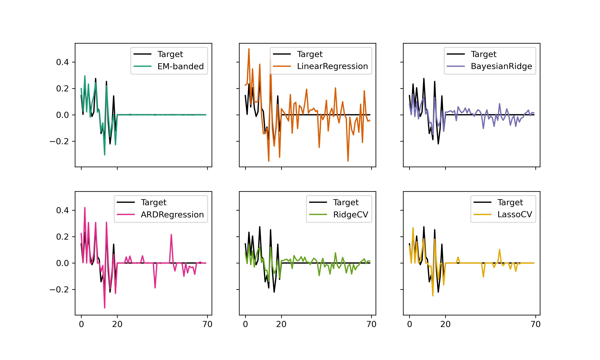
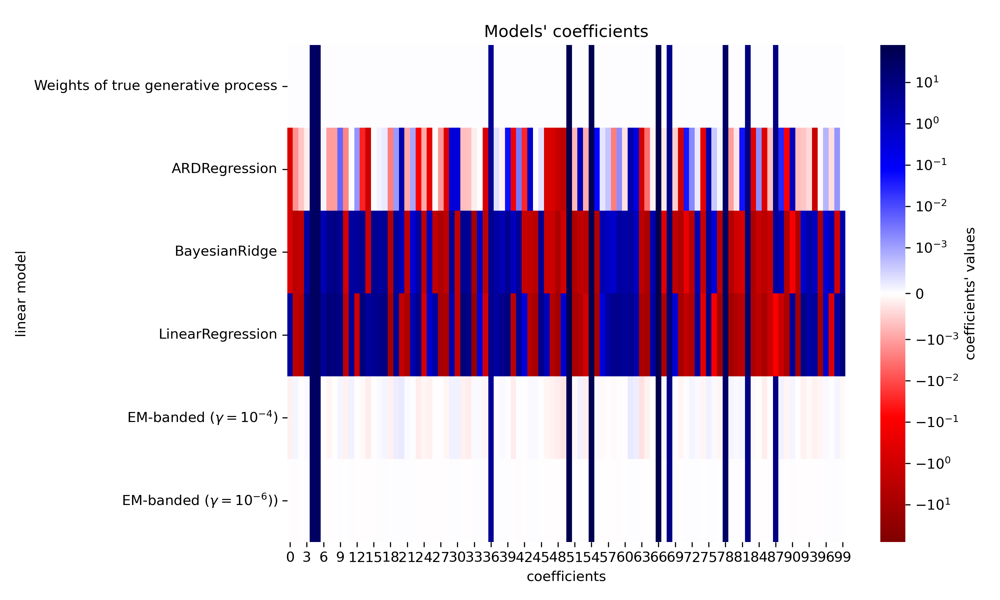

# embanded
Expectation-Maximization algorithm for estimating regularized regression model with banded prior structure. Please see [1] as well as [2,3] for more information about "banded-type" regularization. The repository contains MATLAB code and Python code.

## 1. MATLAB installation
Download the repository and store it in a local folder. Run the [setup.m](setup.m) file. Follow the example scripts available [here](examples/matlab).

## 2. Python installation
Create a conda environment, for example, by using `conda create -n embanded python==3.11 pip`. Activate the new environment with `conda activate embanded`. Install embanded using one of the following approaches:

1. Install directly from git: `pip install git+https://github.com/safugl/embanded.git` for minimal installation.  Alternatively, for installing all packages required for the examples use `pip install "embanded[examples] @ git+https://github.com/safugl/embanded@main"`. 
2. Download the repository, navigate to the directory, and execute `pip install .` for minimal installation.  Alternatively, for installing all packages required for the examples use `pip install ".[examples]"`.

Follow the example scripts available [here](examples/python). 

## 3. Runtime tests
Please see [here](examples/runtime/) for runtime tests. 

## 4. Examples 
- Matlab example scripts are available [here](examples/matlab/).
- Python scripts are available [here](examples/python/).
A few additional examples are highlighted below. 

### 4.1. Simulation example with Python
This example uses synthetic data. Several models are fit to the data using scikit-learn [6,7]. The below figure shows the target weights (black) along with the estimated weights for each estimator. The top left panel shows estimate with EM-banded. The script is available [here](examples/python/example_sklearn_02.py).

### 4.2. Simulation example with Python
This example uses a synthetic dataset created by [5] for scikit-learn. An EM-banded model is fit to the data. Separate regularization hyperparameters are declared to each predictor. The figure below has been modified from the tutorial described by [5]. It now also includes weights estimated by two EM-banded estimators. The modified script is available [here](examples/python/example_sklearn_01.py).

### 4.3. EEG encoding example with Matlab
This example illustrates how to use the model for estimating temporal response functions from electroencephalography (EEG) data. The data used for this example is publicly available and was originally described in [4]. The example imports epoched EEG data and envelope features and fits regression models to data from each participant. The scripts relies on a [function](matlab/functions/timelag.m) for augmenting the stimulus feature with multiple time lags. The script is available [here](examples/matlab/example_eeg_encoding.m).

### 4.4. Decoding example using synthetic data with Matlab
This example uses a synthetic data set to fit a decoding model. The example simulates an envelope and multi-channel response data that contains a mixed version of the envelope. The script fits two different EM-banded decoding models and one Ridge decoding model. The models are used to predict held-out data. The scripts relies on a [function](matlab/functions/timelag.m) for augmenting the responses with multiple time lags. The script is available [here](examples/matlab/example_simulation_decoding.m).

## 5. References
1. Fuglsang, S. A., Madsen, K. H., Puonti, O., Siebner, H. R., Hjortkjær J. (2023) Exploring an EM-algorithm for banded regression in computational neuroscience. Available at: https://doi.org/10.1101/2023.09.22.558945 
2. Nunez-Elizalde AO, Huth AG, Gallant JL (2019) Voxelwise encoding models with non-spherical multivariate normal priors. Neuroimage 197:482–492 Available at: https://doi.org/10.1016/j.neuroimage.2019.04.012.
3. Dupré la Tour T, Eickenberg M, Nunez-Elizalde AO, Gallant JL (2022) Feature-space selection with banded ridge regression. Neuroimage 264. Available at: https://doi.org/10.1016/j.neuroimage.2022.119728
4. Broderick, Michael P., et al. "Electrophysiological correlates of semantic dissimilarity reflect the comprehension of natural, narrative speech." Current Biology 28.5 (2018): 803-809. Available here: https://doi.org/10.1016/j.cub.2018.01.080
5. Amor, Aturo. Simulation available on: "https://scikit-learn.org/stable/auto_examples/linear_model/plot_ard.html#sphx-glr-auto-examples-linear-model-plot-ard-py"
6. Scikit-learn: Machine Learning in Python, Pedregosa et al., JMLR 12, pp. 2825-2830, 2011. https://jmlr.csail.mit.edu/papers/v12/pedregosa11a.html
7. API design for machine learning software: experiences from the scikit-learn project. Buitinck et al., 2013. https://arxiv.org/abs/1309.0238
8. Hunter, John D. "Matplotlib: A 2D graphics environment." Computing in science & engineering 9.03 (2007): 90-95.
9. Waskom, Michael L. "Seaborn: statistical data visualization." Journal of Open Source Software 6.60 (2021): 3021.
