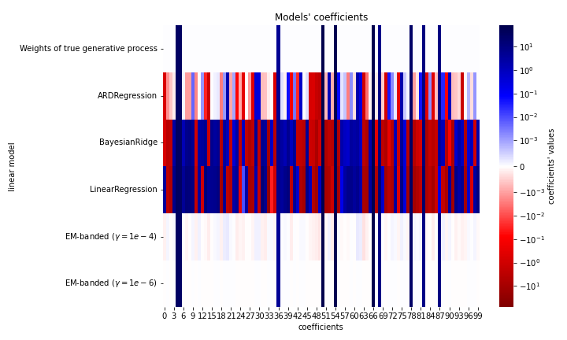
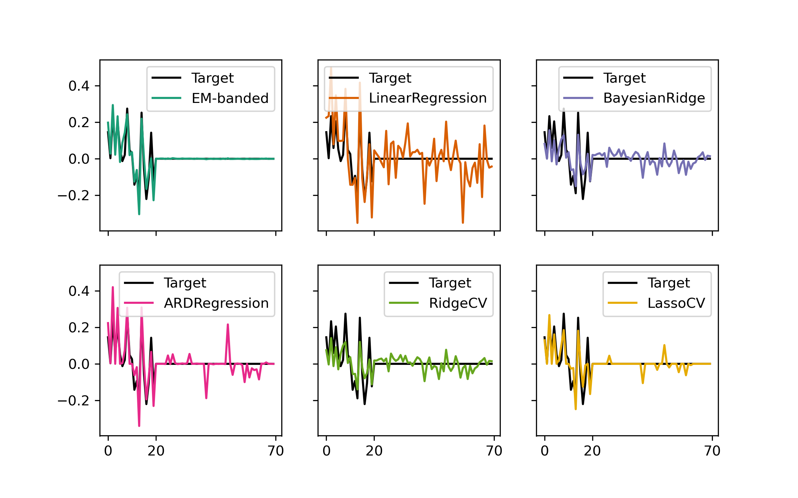

# embanded
Expectation-Maximization algorithm for estimating regularized regression model with banded prior structure. Please see [1] as well as [[2](https://doi.org/10.1016/j.neuroimage.2019.04.012),[3](https://doi.org/10.1016/j.neuroimage.2022.119728)] for more information about "banded-type" regularization. The repository contains MATLAB code and Python code.

## 1. MATLAB installation
Download the repository and store it in a local folder. Run the [setup.m](setup.m) file. Follow the example scripts available [here](examples/matlab).

## 2. Python installation
1. Download [Miniconda3](https://docs.conda.io/projects/miniconda/en/latest/) Python 3 distribution and install it.
2. Download [embanded.whl](https://resources.drcmr.dk/embanded/embanded-0.0.1-py3-none-any.whl). Below we assume that it is stored in ~/Downloads
3. Run the following in a terminal window:

```
export PATH="$HOME/miniconda/bin:$PATH" # Depends on miniconda installation
cd ~/Downloads 
conda create -n embanded python=3.11.4
conda activate embanded
python -m pip install embanded-0.0.1-py3-none-any.whl
```

## 3. Examples 
- Matlab example scripts are available [here](examples/matlab/)
- Python scripts are available [here](examples/python/). Several of the examples relies on scikit-learn [6,7], matplotlib [[8](https://doi.ieeecomputersociety.org/10.1109/MCSE.2007.55)], and seaborn [[9](https://doi.org/10.21105/joss.03021)].

A few additional examples are highlighted below. 

### 3.1. Simulation example with Python
This example uses a synthetic dataset created by Arturo Amor [[5](https://scikit-learn.org/stable/auto_examples/linear_model/plot_ard.html#sphx-glr-auto-examples-linear-model-plot-ard-py)] for scikit-learn (see [scikit-learn.org](https://scikit-learn.org/stable/auto_examples/linear_model/plot_ard.html#sphx-glr-auto-examples-linear-model-plot-ard-py)). We fit an EM-banded model to the synthetic data and declare separate regularization hyperparameters to each predictor. The modified script is available [here](examples/python/example_sklearn.py). The figure generated from the scikit-learn [6,7] tutorial is modified to include estimated weights by EM-banded estimators. The modified figure is shown below:



### 3.2. Simulation example with Python
The following code block simulates synthetic data and fits a model to these data. A few alternative models are shown for comparison. These models are fit using [scikit-learn](https://jmlr.csail.mit.edu/papers/v12/pedregosa11a.html) [6,7]. 

```
import embanded
import matplotlib.pyplot as plt
import numpy as np

np.random.seed(1)

F1 = np.random.randn(100,20)
F2 = np.random.randn(100,50)
F = [F1,F2] 
X  = np.concatenate(F,axis=1)
W  = np.concatenate([np.random.randn(20,1), np.zeros((50,1))],axis=0)/np.sqrt(40)
N =  np.random.randn(100,1)/np.sqrt(2)
Y = X@W +  N
clf_em = embanded.EMBanded(num_features=len(F),remove_intercept=True,max_iterations=200,
                                   tau =1e-4,
                                   phi=1e-4,
                                   eta=1e-4,
                                   kappa=1e-4)
clf_em.fit(F,Y)

"""
To visualize without fitting other models:
plt.plot(W,'-k',label='Target'),plt.plot(clf_em.W.ravel(),label='EM-banded'), plt.legend()
"""

import pandas as pd
from sklearn.linear_model import ARDRegression, BayesianRidge, LinearRegression
from sklearn.linear_model import RidgeCV,LassoCV
clf_olr = LinearRegression().fit(X,  Y.squeeze())
clf_brr = BayesianRidge(compute_score=True, max_iter=300).fit(X, Y.squeeze())
clf_ard = ARDRegression(compute_score=True, max_iter=300).fit(X, Y.squeeze())
clf_ridgecv = RidgeCV(alphas=[1e-5,1e-4,1e-3, 1e-2, 1e-1, 1,10,100,1000]).fit(X, Y.squeeze())
clf_lassocv = LassoCV(cv=5, random_state=0).fit(X, Y.squeeze())

summary   = dict(emb=(clf_em.W,'EM-banded'),
                 olr=(clf_olr.coef_,'LinearRegression'),
                 brr=(clf_brr.coef_,'BayesianRidge'),
                 ard=(clf_ard.coef_,'ARDRegression'),
                 ridgecv=(clf_ridgecv.coef_,'RidgeCV'),
                 lassocv=(clf_lassocv.coef_,'LassoCV'))

import matplotlib as mpl
cmap = mpl.colormaps['Dark2'].resampled(8)
f, ax = plt.subplots(2,3,figsize=(8,5),sharex=True,sharey=True)
ax = ax.reshape(-1)
for k, key in enumerate(summary.keys()):
    ax[k].plot(W,label='Target',color='k')
    ax[k].plot(summary[key][0],'-',label=summary[key][1],color=cmap(k))
    ax[k].legend()
    ax[k].set_xticks([0,20,70])

```

The below figure shows the target weights (black) along with the estimated weights for each estimator.




### 3.3. EEG encoding example with Matlab
[This](examples/matlab/example_eeg_encoding.m) example illustrates how to use the model for estimating temporal response functions from electroencephalography (EEG) data. The data used for this example is publicly available [here](https://datadryad.org/stash/dataset/doi:10.5061/dryad.070jc) and was originally described in [[4](https://doi.org/10.1016/j.cub.2018.01.080)]. The example imports epoched EEG data and envelope features and fits regression models to data from each participant. The scripts relies on a [function](examples/matlab/func/timelag.m) for augmenting the stimulus feature with multiple time lags.

### 3.4. Decoding example using synthetic data with Matlab
[This](examples/matlab/example_simulation_decoding.m) example uses a synthetic data set to fit a decoding model. The example simulates an envelope and multi-channel response data that contains a mixed version of the envelope. The script fits two different EM-banded decoding models and one Ridge decoding model. The models are used to predict held-out data. The scripts relies on a [function](examples/matlab/func/timelag.m) for augmenting the responses with multiple time lags.

## 4. References
[1] Fuglsang, S. A., et al., "Exploring an EM-algorithm for banded regression in computational neuroscience" 2023

[2] Nunez-Elizalde AO, Huth AG, Gallant JL (2019) Voxelwise encoding models with non-spherical multivariate normal priors. Neuroimage 197:482–492 Available at: https://doi.org/10.1016/j.neuroimage.2019.04.012.

[3] Dupré la Tour T, Eickenberg M, Nunez-Elizalde AO, Gallant JL (2022) Feature-space selection with banded ridge regression. Neuroimage 264. Available at: https://doi.org/10.1016/j.neuroimage.2022.119728

[4] Broderick, Michael P., et al. "Electrophysiological correlates of semantic dissimilarity reflect the comprehension of natural, narrative speech." Current Biology 28.5 (2018): 803-809. Available here: https://doi.org/10.1016/j.cub.2018.01.080

[5] Amor, Aturo. Simulation available on: "https://scikit-learn.org/stable/auto_examples/linear_model/plot_ard.html#sphx-glr-auto-examples-linear-model-plot-ard-py"

[6] [Scikit-learn: Machine Learning in Python](https://jmlr.csail.mit.edu/papers/v12/pedregosa11a.html), Pedregosa et al., JMLR 12, pp. 2825-2830, 2011.

[7] [API design for machine learning software: experiences from the scikit-learn project](https://arxiv.org/abs/1309.0238), Buitinck et al., 2013.

[8] Hunter, John D. "Matplotlib: A 2D graphics environment." Computing in science & engineering 9.03 (2007): 90-95.

[9] Waskom, Michael L. "Seaborn: statistical data visualization." Journal of Open Source Software 6.60 (2021): 3021.
