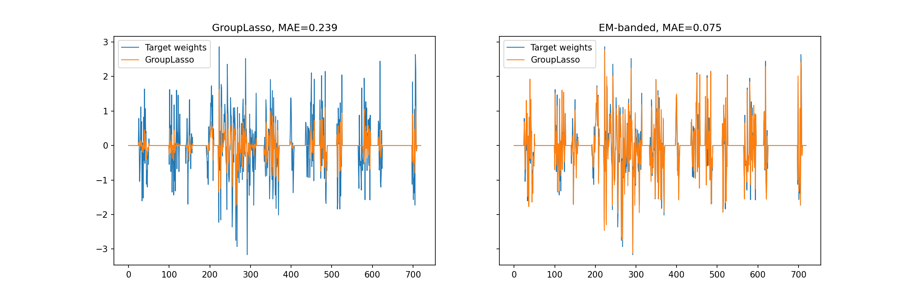
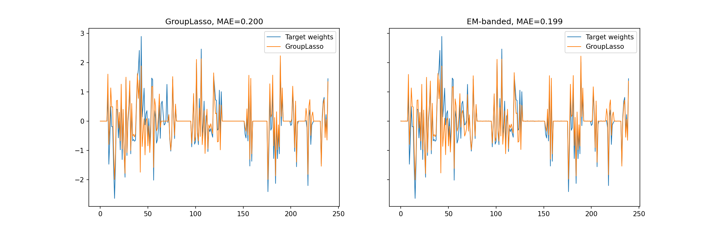

# Examples 
For the sake of transparency, we also illustrate the behavior of the EM-banded estimator in simulation scenarios developed by other authors. Here, we explore simulations developed by [1]. The original simulations are described at https://group-lasso.readthedocs.io and can be found [here](https://group-lasso.readthedocs.io/en/latest/auto_examples/index.html). It is necessary to install group-lasso in order to run the modified examples. Notice that the EM-banded model does not yield truly (group-wise) sparse solutions, and weight pruning would have to be considered for this estimator.

## Example 1
This example uses code developed by [1]. The original code can be found [here](https://github.com/yngvem/group-lasso/blob/master/examples/example_group_lasso.py). We modified the code so that it now also involves fitting an EM-banded model to the data. Additionally, the modified code now visualizes weights estimated by the two estimators. The modified script can be found in this folder. The figure below depicts weights estimated by the two estimators along with the target weights.

## Example 2
This example again uses code developed by [1]. The original code can be found [here](https://github.com/yngvem/group-lasso/blob/master/examples/example_sparse_group_lasso.py). We modified the code so that it now also involves fitting an EM-banded model to the data. Additionally, the modified code now visualizes weights estimated by the two estimators. The modified script can be found in this folder. The figure below depicts weights estimated by the two estimators along with the target weights.

# References 

[1] Moe, Yngve Mardal. "group-lasso 1.5.0."
